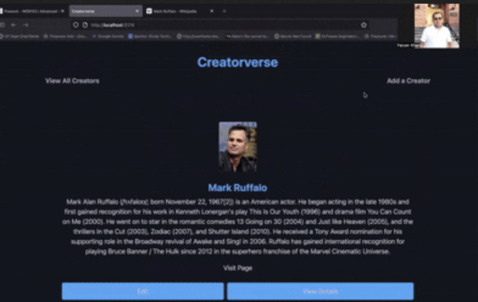

# Creatorverse

Creatorverse is a React app that lets you share and manage your favorite content creators—Twitch streamers, YouTubers, Instagram personalities, TikTokers, and more! You can add, view, edit, and delete creators, each with a name, URL, description, and optional image.

---

## Features

- **View all creators:** See a list of at least five content creators on the homepage.
- **View creator details:** Click a creator to see their full profile on a unique URL.
- **Add a creator:** Fill out a form to add a new creator (name, URL, description, image).
- **Edit a creator:** Update any creator’s info.
- **Delete a creator:** Remove a creator from the list.
- **Responsive design:** Works on desktop and mobile.
- **Modern UI:** Styled with PicoCSS and custom CSS for a clean, card-based look.
- **Image support:** Show a creator’s image or a placeholder if none is provided.

---

## Stretch Features

- **Card layout:** Creators are displayed as cards in a responsive grid.
- **Custom confirmation dialog:** Deleting a creator uses a custom modal for confirmation.
- **Empty state illustration:** Friendly message and illustration when no creators are present.

---

## Tech Stack

- **Frontend:** React (with Vite)
- **Routing:** React Router
- **Styling:** PicoCSS + custom CSS
- **Database:** Supabase (PostgreSQL)
- **API:** Supabase JS client

---

## Getting Started

1. **Clone the repo:**
   ```bash
   git clone https://github.com/<your-username>/creatorverse.git
   cd creatorverse
   ```

2. **Install dependencies:**
   ```bash
   npm install
   ```

3. **Set up Supabase:**
   - Create a Supabase project and table as described in the project instructions.
   - Add your Supabase URL and API key to `src/client.js`.

4. **Run the app:**
   ```bash
   npm run dev
   ```

---

## Screenshots




---

---

## Demo Recording


---

## Completed Features

- [x] Logical React component structure
- [x] Display at least five creators on homepage
- [x] Each creator shows name, URL, description, and image
- [x] Async API calls with async/await
- [x] Unique URL for each creator
- [x] View, add, edit, and delete creators
- [x] Responsive, card-based layout
- [x] Custom confirmation dialog for deletes
- [x] PicoCSS styling

---

## How to Use

- **Add a creator:** Click "Add a Creator" and fill out the form.
- **View details:** Click a creator card.
- **Edit:** Click "Edit" on a creator’s detail page.
- **Delete:** Click "Delete" and confirm in the dialog.

---

## Credits

Built for the CodePath WEB103 Prework